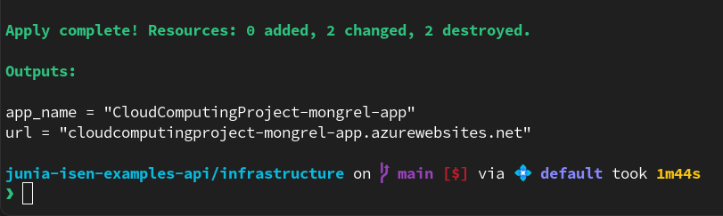
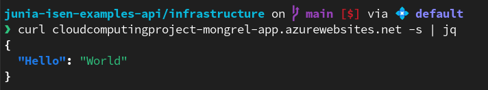
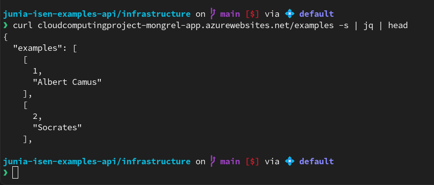
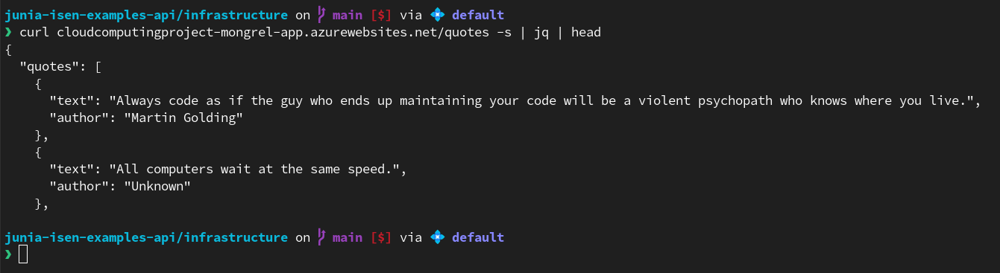

# Introduction

This is a Cloud Computing Project, the team members of this project are:
- Audran TOURNEUR
- Iémélian RAMBEAU
- Judith LECOQ
- Simon BERNARD DE LAJARTRE

# Usage instruction

```sh
git clone https://github.com/AudranTourneur/junia-isen-examples-api
cd junia-isen-examples-api/infrastructure
terraform init
# You may want to set your terraform.tfvars before
terraform apply
```

# Local usage

As an iniative, a `docker-compose.yml` file has been added for local development.
After setting your `.env` following the `.env.example` file, you will be able to run `docker compose up -d`.

# Contributing

- Git commits must be written in English and conform to the [Convential Commit](https://www.conventionalcommits.org/en/v1.0.0/) specification, allowed types are those present in the [Karma specification](https://karma-runner.github.io/6.4/dev/git-commit-msg.html) as well as `ci` and `chore`.
Additionally, all commits must be cryptographically signed, non-signed commits will be rejected by the GitHub repository rules.

To enforce style rules, as an intiative, a commitlint workflow has been created. See `commitLint.yml`.
Moreover, on a UNIX-like system, you may run the following script to enforce theses rules locally at commit time:

```shell
./git/git-setup
```

# Auto-deploy

An automatic workflow has been setup to deploy the application whenever a commit hit the main branch. See `docker-build-and-publish.yml`.

# Application tests

A workflow has been setup to run Python tests on commits and pull requests targeting the main branch, see `test.yml`.

# Terraform tests

A test has been added to check that the application returns a HTTP 200 response when deployed. See the `infrastructure/tests` folder.

# Security

Both the database and the blob storage should *not* be accessible from the public Internet. 
Only the application itself is effectively able to access these resources.

# Application demo

## Terraform apply

After running `terraform apply` with the correct variables and waiting about 10 minutes the first time (more or less), terraform should give you the deployed URL as output:



## Route /



## Route /examples



This is coming from the Postgres database.

## Route /quotes



This is coming from the Blob storage.
